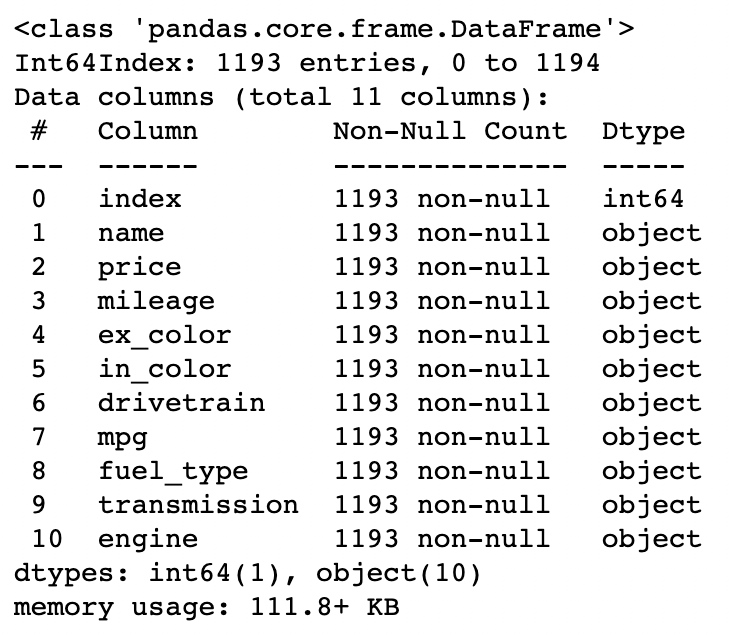
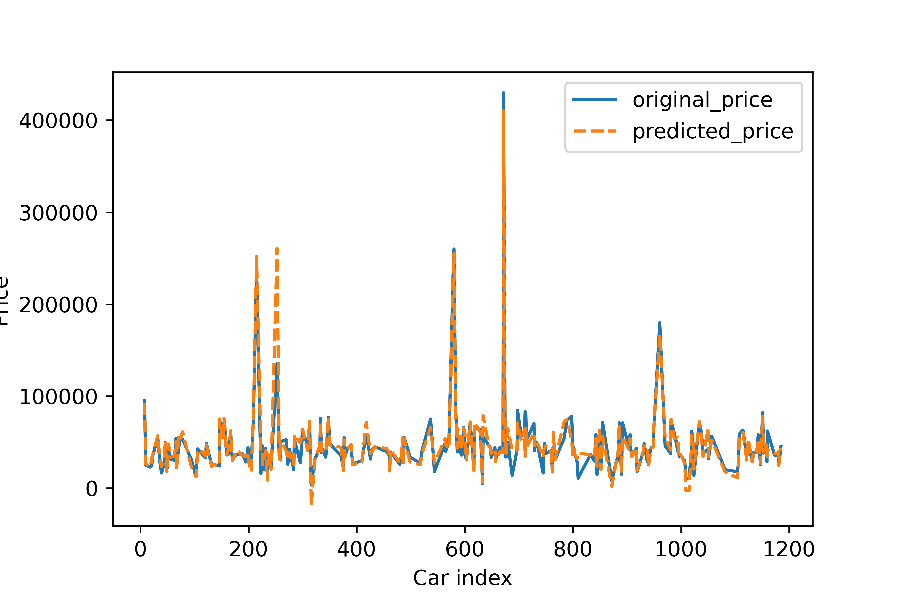
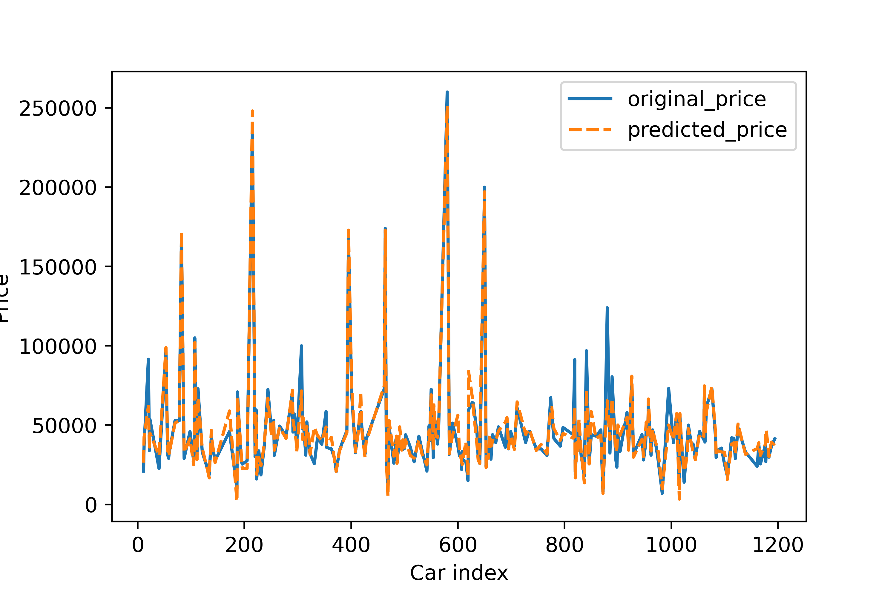

# Car Price Prediction
## Table of Contents
- [Abstract](#link-part-1)
- [Design](#link-part-2)
- [Data](#link-part-3)
- [Algorithm](#link-part-4)
- [Tools](#link-part-5)
- [Communication](#link-part-6)
- [**How to run**](#link-part-7)

## <a name="link-part-1">Abstract</a>

The goal of this project was to build a regression model to predict used
car prices. I worked with data scraped from [cars.com](https://www.cars.com)
to achieve training the model. Based on the prices we have, we are able to
predict car prices in a few years to make a better choice on when to get which
used cars.

## <a name="link-part-2">Design</a>

Nowadays, because of the COVID situation, used cars are getting more and more expensive.
People are usually confused if they should get a car now or if they should wait. Hence,
more and more people need a car price predicting tool to predict the price of used cars
to avoid spending too much money.

For car owners, they are also able to predict their cars' prices in a few years using
this model, which can help them decide when to sell their car and get a car at the same
time with the best deal.

## <a name="link-part-3">Data</a>

The dataset I used is scraped from [cars.com](https://www.cars.com)
containing 1193 rows of data.

Each row will represent one used car that is on sale on [cars.com](https://www.cars.com).
The information includes year, module, make, price, mileage, color,
drivetrain, mpg, fuel type, transmission type, and engine. 

## <a name="link-part-4">Algorithm</a>

**Web Scraping**

1. Getting used car list url
2. Using the url of the first page to get the urls of the first 60 pages.
3. Scraping name, price, mileage information from every page.
4. Scraping every used car's individual page link from every page.
5. Scraping each used car's page to get color, drivetrain, mpg, fuel type, transmission and engine information.
6. Saving the information in a dataframe and then saving into a csv file for modeling.

**Feature Engineering**

1. Converting fuel type, car make and model, transmission into dummies.
2. Converting MPG into int type by add lowest mpg to highest mpg.
3. Breaking down car engines into liters and volts.
4. Breaking down drivetrain into 2-wheel-drive and 4-wheel-drive

**Models**

The first linear regression model has a huge overfitting problem. The train $R^2$ value
is usually around 0.95 while the test $R^2$ value is around 0.70 to 0.80. Then I tuned
the lasso regression model which is this final model and added ploynomial features which
solves the overfitting problem and massively increased the performance. Lasso excluded
lots of features including is_gas, age, engine_L and many car makes. Now the train $R^2$
value and test $R^2$ value are both around 0.98.

**Model Evaluation**

The entire training dataset of 1193 records was split into 80/20 train vs. holdout, and all
scores reported below were validated from both train dataset and holdout dataset.

**Final Score: 0.980**

## <a name="link-part-5">Tools</a>

* **Pandas** for exploratory data analysis
* **Matplotlib** and **Seaborn** for plotting
* **Beautifulsoup** and **Requests** for web scraping
* **Scikit Learn** and **Statsmodels** for building regression model
* **Pickle** for saving regression models in a pickle file

## <a name="link-part-6">Communication</a>

* [Data](/data/car_info.csv) scraped from [cars.com](https://www.cars.com):

* [Linear regression model](/models/linear_model_pkl) test:

**Train $R^2$ score: 0.958**

**Test $R^2$ score: 0.765**

* [Lasso regression model](/models/lasso_model_pkl) test: (Solved overfitting)

**Train $R^2$ score: 0.985**

**Test $R^2$ score: 0.980**

The project proposal is shown [here](/documents/proposal.md).

MVP documentation is shown [here](/documents/MVP.md).

The slides to the project are not here yet.

## <a name="link-part-7">How to run</a>

**To get data:**

* Use [this dataset](/data/car_info.csv) or scrape [cars.com](https://www.cars.com)
by running [web_scraping](/web_scraping.ipynb).

**To train the model:**

* Run [car_price_prediction](/car_price_prediction.ipynb) in Jupyter Notebook.

* Saved models are in [here](/models).
